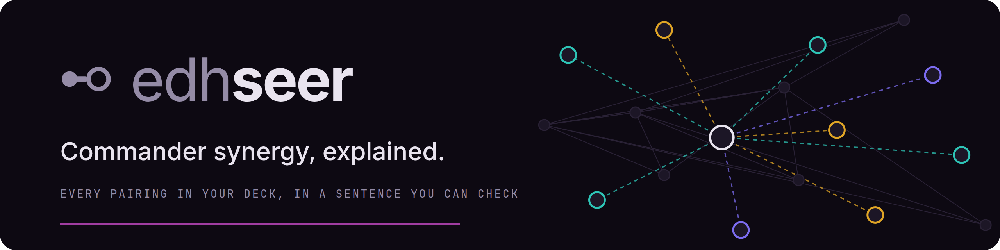
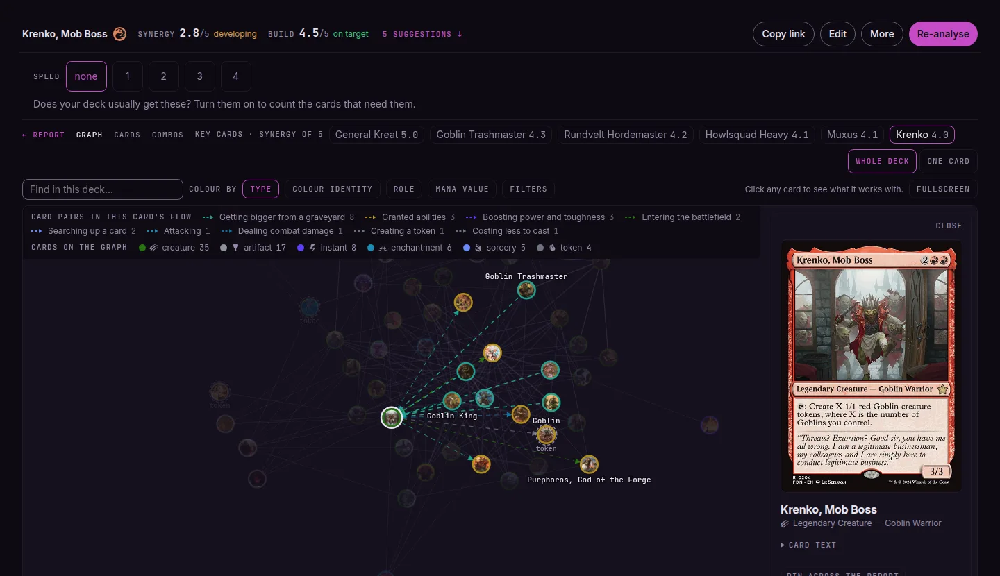
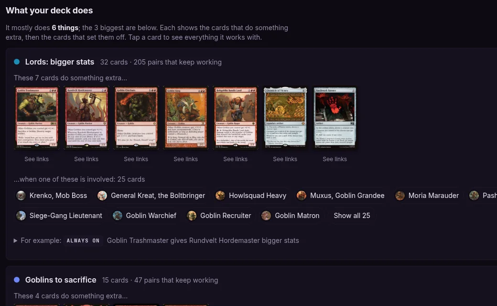
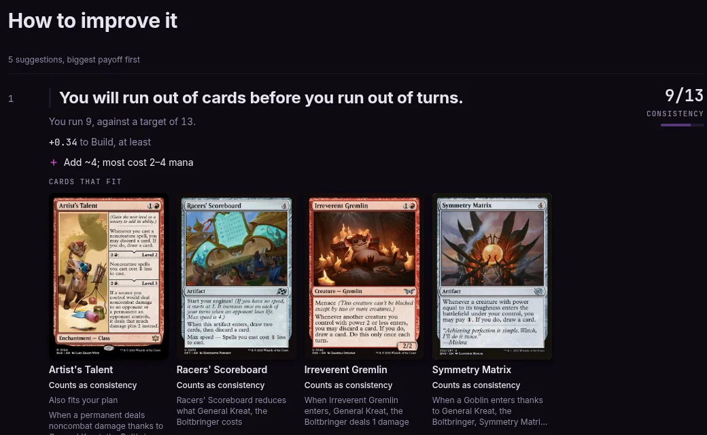
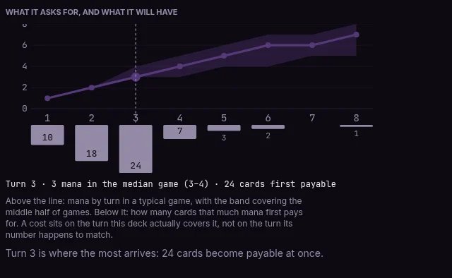

<p align="center">
  <a href="https://edhseer.cards"></a>
</p>

<p align="center">
  <a href="https://edhseer.cards"><strong>Analyse your deck</strong></a>
  &nbsp;·&nbsp;
  <a href="https://edhseer.cards/how-it-works">How it works</a>
  &nbsp;·&nbsp;
  <a href="docs/README.md">Documentation</a>
  &nbsp;·&nbsp;
  <a href="CONTRIBUTING.md">Contributing</a>
</p>

<p align="center">
  <a href="https://github.com/SetsudanHana/edh-seer/actions/workflows/ci.yml"></a>
  <a href="https://github.com/SetsudanHana/edh-seer/actions/workflows/codeql.yml"></a>
  <a href="https://edhseer.cards"></a>
  <a href="LICENSE"></a>
</p>

# EDH Seer

**Paste a Commander decklist and see which of your cards actually work together, with the sentence
that says why.** Free, no account, nothing stored. Paste a list, or a Moxfield or Archidekt link, at
**[edhseer.cards](https://edhseer.cards)**.

[](https://edhseer.cards)

## What you get

- **Every pairing in your deck, in a sentence you can check.** Not a score and not "people also
  play". A claim that names both cards and the mechanism:

  > *"When Siege-Gang Commander dies, Skullclamp draws you 2 cards"*

  Open both cards. If the printed text does not say this, the claim is wrong, and a wrong claim is
  a bug you can report with two card names.
- **A map of your deck.** An interactive graph of every pairing. Click a card to see what it works
  with, and which cards are doing the heavy lifting.
- **What to fix, biggest payoff first.** Card draw, interaction and answers counted against
  benchmarks, with the gap stated in cards: *"You are 2 short on interaction. Add ~2; most cost 2–4
  mana."*
- **Mana you can plan around.** Land count, colour sources, and the odds of casting each of your
  hardest spells on curve, from 2,000 simulated games.
- **Your game plan.** The themes your deck leans on, and the pairs behind each one.
- **Bracket, roles and combos.** Where the deck sits, what each card is doing, and the combos it
  already holds, from [Commander Spellbook](https://commanderspellbook.com/).

| Every pairing, grouped by theme | What to fix, biggest payoff first | Can you cast your cards |
|---|---|---|
|  |  |  |

No deck handy? Every card and every commander has a page of its own that shows what works with it:
[Skullclamp](https://edhseer.cards/cards/skullclamp) ·
[Krenko, Mob Boss](https://edhseer.cards/commanders/krenko-mob-boss) ·
[Atraxa, Praetors' Voice](https://edhseer.cards/commanders/atraxa-praetors-voice) ·
[Inalla, Archmage Ritualist](https://edhseer.cards/commanders/inalla-archmage-ritualist) ·
[Edgar Markov](https://edhseer.cards/commanders/edgar-markov) ·
[Yuna, Grand Summoner](https://edhseer.cards/commanders/yuna-grand-summoner) ·
or [browse every commander](https://edhseer.cards/commanders).

## Why you can trust it

**It reads the cards, not the crowd.** Nothing comes from card names, popularity or which cards
show up together in other people's decks. Every claim comes from printed rules text, so a card no
one plays and a staple in every deck are read the same way.

**No AI when you analyse a deck.** A model reads each card's oracle text exactly once, offline, and
turns it into structured clauses. Everything after that is plain rules: the same deck always gets
the same report, and every sentence traces back to a line on a card.

**It says nothing rather than guess.** A card it cannot read is listed as unread. A pairing it
cannot verify is refused. A silent wrong answer is worse than a missing one.

**And it is measured, not asserted.** Every change to the engine is scored against a frozen panel of
card pairs a person has judged by hand:

| measure | result |
|---|---|
| synergy-claim precision | **98.7%** `[97.1, 99.5]` on 421 live claims |
| retention of pairs judged real | **91.4%** — 383 held, 36 lost |
| judged against | 895 frozen card pairs, every claim hand-judged by a human |
| calibration corpus | 71 real decks |

Measured 2026-09-08 by `npx tsx packages/instruments/src/panel-score.ts`, which is free to re-run.

**The two numbers only mean anything together.** A tool that deleted every claim it was unsure of
would score 100% on the first and collapse on the second. And retention is not recall: the panel
was built from claims this engine already made, so it cannot see a pairing that was never claimed.

## How it works

A pairing is found when something one card **causes** is something another card **cares about**:
Krenko makes Goblin tokens enter, Impact Tremors cares about creatures entering, so the two pair.
Farseek puts a land onto the battlefield, Enduring Courage cares about a creature entering, so they
do not.

```
Scryfall / MTGJSON  ──►  oracle text
                            │
                            ▼  (a model, once per card, offline)
                         clauses          ──  structured sentences
                            │
                            ▼  (pure functions, free)
                      derived tags        ──  what each card causes, what it cares about
                            │
                            ▼  (pure functions, free)
                        pairings          ──  "X causes the event Y cares about"
                            │
                            ▼
                       deck report
```

Only the first arrow costs money, and the project pays it once per card. The rest re-runs for
free, which is why a wrong claim can be fixed and re-measured the same day.

The full story, for players and for engineers, is at
[edhseer.cards/how-it-works](https://edhseer.cards/how-it-works). The tour with the code is
[docs/HOW-IT-WORKS.md](docs/HOW-IT-WORKS.md).

## Honest limitations

- **Corpus coverage.** The corpus is **34,433** cards, of which **28,416** carry derived tags
  (measured 2026-09-09; 31,731 of the 31,829 commander-legal cards are read in full, the 98 left
  being persist-gate refusals). Cards outside that set form no pairings, and the report says so
  rather than quietly under-reporting. Their mana cost, type and text still count everywhere else.
- **A pairing is found or not; it has no weight.** Krenko handing Impact Tremors a token every turn
  and a lone creature entering once are the same pair. A supply/demand magnitude discount was
  built, swept across a 2-D parameter grid, and **refused** on measurement three separate times: it
  consistently penalised exactly the scarce payoffs it was meant to reward.
- **Tutors and recursion pair only when they name a class.** "Search your library for a Goblin"
  pairs with your Goblins and "return an artifact card" with your artifacts. "A card" or "a
  creature card" names most of a deck, so it pairs with nothing rather than with everything.
- **The 71 calibration decks are one player's collection**, not a metagame. Thresholds tuned
  against them are described as such wherever they appear.
- **Mana simulation is a goldfish.** No opponent, no interaction, no removal. Every figure it
  produces is a ceiling under a mana-maximising play policy, and says so.

## For developers

Working, measured, and under active development: a deterministic engine with a regression panel,
several ratchets, and a habit of recording the measurement beside every change.

| package | what it does |
|---|---|
| `@edh-seer/data` | Scryfall + MTGJSON ingestion, MongoDB corpus, name resolution |
| `@edh-seer/tagger` | oracle text → clauses (the paid step) → derived tags (free) |
| `@edh-seer/matcher` | pairings, reasons, archetypes, mana math, build benchmarks, combos |
| `@edh-seer/engine` | scoring, ratings, per-card impact |
| `@edh-seer/cli` | terminal deck report |
| `@edh-seer/web` | NestJS API + React/Vite UI, including the interactive synergy graph |

Node 22 or newer is all the test suite needs:

```bash
npm install
npm test                  # 4,342 tests, green on 2026-09-25. No database, no network, no API key
```

Running the engine on real decks needs MongoDB holding the card corpus:

```bash
npx tsx packages/cli/src/main.ts <decklist.txt>                  # a deck report in the terminal
npx tsx packages/matcher/src/bin/build-static.ts                 # the card shards the site reads
VITE_STATIC_DATA=1 npm run dev:client -w @edh-seer/web           # the site, as production runs it
```

How to get the corpus, and everything else about running it, is in the
[runbook](docs/RUNBOOK.md#running-the-product).

### Documentation

Start at **[docs/](docs/)**, or go straight to what you need:

| document | what it covers |
|---|---|
| [How it works](docs/HOW-IT-WORKS.md) | the tour: a printed card to a synergy graph, with diagrams and a worked example |
| [edhseer.cards/how-it-works](https://edhseer.cards/how-it-works) | the same story on the site: a player's half, then an engineer's half, with the figures above held to this README by a test |
| [Stage 1 — Segmentation](docs/pipeline/1-segment.md) | oracle text into numbered clauses, free |
| [Stage 2 — Normalization](docs/pipeline/2-normalize.md) | the model, once per card. The only paid step |
| [Stage 3 — Derivation](docs/pipeline/3-derive.md) | clauses into game events, plus what no card prints |
| [Stage 4 — Matching](docs/pipeline/4-match.md) | what one card causes against what another cares about, and every reason a claim is refused |
| [Schema reference](docs/reference/SCHEMA.md) | every vocabulary, constant and field. Generated from the source and gated by a test |
| [Runbook](docs/RUNBOOK.md) | what to run, what it costs, how to measure it afterwards |
| [Engineering log](docs/engineering-log/) | what was measured, on what day, and what it cost |

Contributing: **[CONTRIBUTING.md](CONTRIBUTING.md)**. Found a wrong pairing?
[Report it](https://github.com/SetsudanHana/edh-seer/issues/new?template=wrong-edge.yml) with the
two card names and the sentence the report printed. It is the most useful issue this project can
receive.

## License

MIT — see [LICENSE](LICENSE).

Card data from [Scryfall](https://scryfall.com) and [MTGJSON](https://mtgjson.com). Combo data from
[Commander Spellbook](https://commanderspellbook.com/). Magic: The Gathering is a trademark of
Wizards of the Coast. This project is unaffiliated with them.
