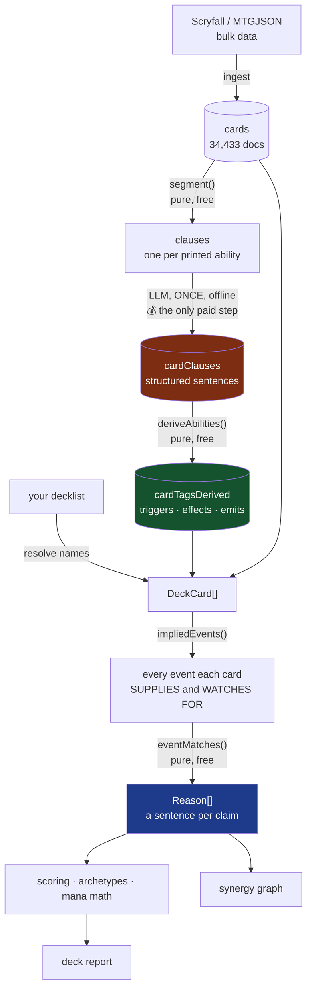
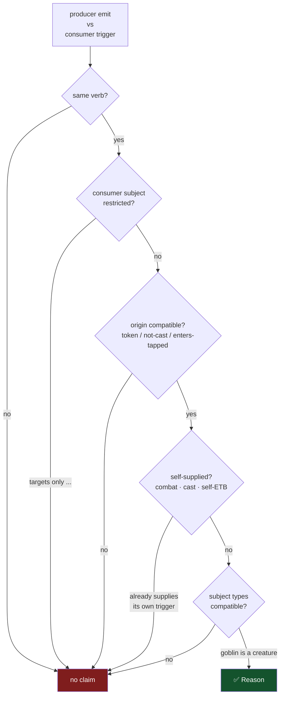
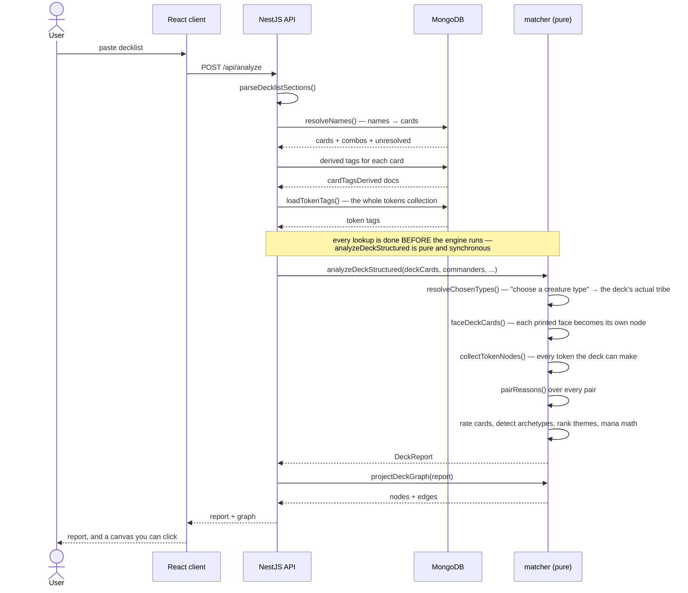
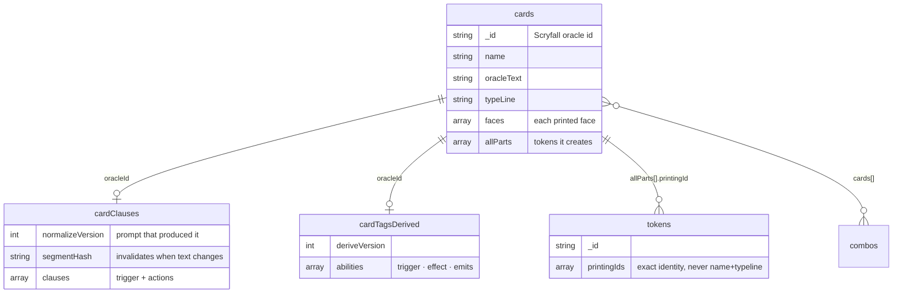

# How EDH Seer works

From a printed Magic card to a synergy graph, step by step.

The thesis in one sentence: **a language model reads oracle text exactly once, offline, and turns it
into structured data — everything after that is deterministic code.** That is what makes the engine
measurable. Change a rule and you get a diff you can read, not a different mood.

---

## The whole pipeline



Only the red box costs money. Everything green and blue is re-runnable for free, which is why the
engine can be changed and re-measured dozens of times a day.

---

## Worked example

Every stage below shows **real output** for one real pair, captured from the live corpus:
**Siege-Gang Commander** and **Skullclamp**.

The claim we are working towards is the one the app actually prints:

> *"When Siege-Gang Commander dies, Skullclamp draws you 2 cards"*

---

### Stage 0 — Ingestion

Scryfall bulk data and MTGJSON are merged into one `cards` collection, keyed on the Scryfall
**oracle id** (never on name — names collide, and 92 of 661 token names collide with real cards).

```
name:        "Siege-Gang Commander"
typeLine:    "Creature — Goblin Warrior"
manaCost:    "{3}{R}{R}"
oracleText:  "When this creature enters, create three 1/1 red Goblin creature tokens.
              {1}{R}, Sacrifice a Goblin: This creature deals 2 damage to any target."
```

Non-gameplay layouts (art cards, tokens-as-products, memorabilia) are filtered out here. Tokens go
to their own `tokens` collection — nobody puts a token in a decklist, but tokens are nodes later.

### Stage 1 — Segmentation (`segment()`, pure, free)

Oracle text is split into clauses, one per printed ability, and each is classified. No model
involved.

```
{id:1, kind:"ability"}  "When this creature enters, create three 1/1 red Goblin creature tokens."
{id:2, kind:"ability"}  "This creature deals 2 damage to any target."
```

Skullclamp, for contrast, produces three clauses — and the third is *inert*:

```
{id:1, kind:"ability"}  "Equipped creature gets +1/-1."
{id:2, kind:"ability"}  "Whenever equipped creature dies, draw two cards."
{id:3, kind:"keyword"}  "Equip {1}"
```

`kind` matters: a `keyword` or `reminder` clause is inert and never reaches the model, which is how
a card whose whole text is "Flying" costs nothing to process.

> ⚠️ Inertness has bitten this project twice. Cycling and Extort live *entirely inside reminder
> text*, so both were invisible for months. Where a keyword's reminder **is** the ability, it is
> handled separately at match time rather than through the model.

### Stage 2 — Normalization (the LLM, once, offline) 💰

Each non-inert clause is turned into a structured sentence: an ability type, a trigger, and a list
of actions with verbs drawn from a **closed vocabulary**.

```json
{"id":1,"abilityType":"triggered",
 "trigger":{"event":"enters","subject":"this creature","control":"you"},
 "actions":[{"verb":"create","object":"three 1/1 red Goblin creature tokens","amount":null}]}

{"id":2,"abilityType":"activated",
 "actions":[{"verb":"sacrifice","object":"a Goblin"},
            {"verb":"deal-damage","object":"any target","amount":"2"}]}
```

Three properties make this safe to depend on:

- **One card per request.** Batching many cards into one prompt was measured to drop and duplicate
  clauses (32 clauses returned where 39–41 were correct). The Anthropic Batch API is used for the
  50% discount, but it still sends one card per request.
- **A closed vocabulary.** `event` and `verb` must come from fixed lists. An answer using a word
  that is not in the list is **refused and not persisted** — the card simply re-queues.
- **A persist gate.** Invented clause ids, duplicate ids, ability-type disagreements with the
  segmenter, and unknown trigger events are all rejected. A refusal is visible; a banked guess is
  not.

### Stage 3 — Derivation (`deriveAbilities()`, pure, free)

Clauses become typed **abilities**: a trigger (what the card *watches for*) and emits (what the card
*supplies*). Structured text becomes structured game events.

**Siege-Gang Commander**
```
kind=triggered  effect=token-generation
  trigger: enters  subject={control:"you", type:"creature", self:true}
  emit:    create-token {control:"you", token:true, colors:["R"], type:"creature", subtype:"goblin"}
  emit:    enters       {control:"you", token:true, colors:["R"], type:"creature", subtype:"goblin"}

kind=activated
  emit:    sacrifice    {control:"you", subtype:"goblin"}
  emit:    dies         {control:"you", subtype:"goblin"}     ← the one that matters

kind=activated  effect=damage
  emit:    non-combat-damage {control:"any", scope:"target"}
```

**Skullclamp**
```
kind=static     effect=pump
kind=triggered  effect=draw-card
  trigger: dies  subject={control:"you", type:"creature"}      ← the demand
  emit:    draw  {control:"you"}
```

This stage is **free and versioned** (`DERIVE_VERSION`, currently 85). Because it costs nothing, the
derivation rules have been changed and the whole corpus re-derived many times — which is exactly the
property that makes the engine improvable.

### Stage 4 — Implied events

A card supplies events **nobody printed on it**. A creature can be cast, can enter, can attack, can
deal combat damage — none of which its text mentions. `impliedEvents()` adds these, stamped with the
card's own printed characteristics.

Siege-Gang Commander's full supply list, as the matcher sees it:

```
create-token       {control:"you", token:true, colors:["R"], type:"creature", subtype:"goblin"}
enters             {control:"you", token:true, ..., subtype:"goblin", zone:"battlefield"}
sacrifice          {control:"you", subtype:"goblin"}
leaves             {control:"you", subtype:"goblin", zone:"battlefield"}
non-combat-damage  {control:"any", scope:"target"}
cast               {control:"you", type:"creature", subtype:"goblin", power:2, toughness:2, manaValue:5}   ← implied
enters             {control:"you", type:"creature", subtype:"goblin", ..., zone:"battlefield"}             ← implied
attacks            {control:"you", type:"creature", subtype:"goblin", ...}                                 ← implied
combat-damage      {control:"you", type:"creature", subtype:"goblin", ...}                                 ← implied
enters             {control:"you", subtype:"goblin", zone:"graveyard"}                                     ← a death fills a graveyard
```

Rules the game states but no card prints are added here too — a Saga sacrifices itself after its
final chapter (CR 704.5s), the legend rule kills a copy of a legendary permanent (CR 704.5j). No
amount of text parsing can reach those, because they are not written anywhere.

### Stage 5 — Matching (`eventMatches()`, pure, free)

Every card's **supply** is compared against every other card's **demand**.



For our pair:

| | verb | subject |
|---|---|---|
| Siege-Gang **supplies** | `dies` | `{control: you, subtype: goblin}` |
| Skullclamp **demands** | `dies` | `{control: you, type: creature}` |

Same verb. Same controller. A Goblin *is* a creature — resolved through a subtype→type hierarchy
generated from MTGJSON, not hardcoded. So a claim forms:

```
tag        = "dies:creature"
effectKind = "draw-card"
text       = "When Siege-Gang Commander dies, Skullclamp draws you 2 cards"
```

**The `text` is the product.** An edge you cannot check is worth nothing; every claim renders as a
sentence naming both cards and the mechanism, so a player can hold it against the card and disagree.

### Stage 6 — Scoring, archetypes, and the graph

Reasons feed everything downstream:

- **per-card rating** — weighted by effect kind and by how well the claim sits on the deck's theme axis
- **archetype detection** — matched on card signals, with supply counted at a discount to demand
- **theme ranking** — tf-idf over tags against a corpus-wide statistic
- **the graph** — cards become nodes, reasons become edges; **tokens are nodes too**, so a token
  maker edges to the token and the token edges to the payoff, rather than the maker claiming a
  relation it only has through an object

---

## A request, end to end



The `Note` is the load-bearing part: **the engine performs no I/O.** Every lookup happens first and
the result is handed in. That is what makes it testable without a database — and what would let the
whole thing run in a browser against static JSON.

---

## Data model



`segmentHash` is what makes re-buying unnecessary: if a card's oracle text, type line and keywords
are unchanged, its clauses are still valid however many times the rules around them change.

---

## What costs money, and what does not

| layer | artifact | cost to redo |
|---|---|---|
| segment + normalize | `cardClauses` | **money** — one LLM call per card |
| derive | `cardTagsDerived` | free — pure functions |
| implied events + match | edges, reasons | free — pure functions |
| score, report, graph | `DeckReport` | free |

Four version constants control what gets re-bought:

| constant | current | bumping it means |
|---|---|---|
| `NORMALIZE_VERSION` | 14 | identifies the prompt; free to bump |
| `NORMALIZE_MIN_COMPATIBLE` | 3 | **re-buys the entire corpus** — raise only for a breaking change |
| `VOCAB_VERSION` / `TRIGGER_VOCAB_VERSION` | 13 / 14 | re-asks only cards that fell back to the escape hatch |
| `DERIVE_VERSION` | 85 | free — re-derive and measure |

---

## Why the engine says nothing

A large part of the code exists to **refuse**. The governing rule: *a silent wrong answer is worse
than a missing one.*

| refusal | why |
|---|---|
| **Self-reference** — "this creature", "this spell", the card's own name | reading these as a class once produced **74% of all false edges** |
| **Self-supplied triggers** — a creature's own attack satisfying "whenever a creature attacks" | the card would claim synergy with itself |
| **Unknown trigger events** | surfaced as `unknownTriggers` rather than snapped to a near-miss verb |
| **Unrepresentable restrictions** — "targets only", "non-Dragon", board states with no field | the ability keeps its kind and claims no cards |
| **Deck roles** — cost reduction, tax | a pairwise edge would make the same claim beside every card |
| **Bare-type tutors** — "search for a creature card" | true of the whole creature base, so it distinguishes nothing |

Some misses are permanent and documented as **ceilings**, not bugs: "my tutor can find you" and "my
recursion could return you" are real synergies that a producer-event/consumer-trigger model cannot
express at all.

---

## How correctness is measured

- **A frozen panel** of 895 card pairs, every claim hand-judged by a human on both the *real* and
  *false* side. Precision **95.1% [92.5, 96.8]**.
- **Population diffs** — every change reports edges and reasons before and after.
- **A mesh census** — a single card claiming relations to 50+ others fails a gate; that is the shape
  an over-general rule takes.
- **Ratchets** — quarantined known defects are capped, and a quarantined case that starts passing
  *fails the build*, so improvements have to be banked rather than drifting.

The panel is deliberately blind outside its 895 pairs. A correctness fix that removed 204 edges once
moved it by exactly zero — which is why population diffs are read alongside it, never instead.

---

## Where to look in the code

| stage | package | file |
|---|---|---|
| ingest | `@edh-seer/data` | `scryfall.ts`, `bin/ingest-*.ts` |
| segment | `@edh-seer/tagger` | `segment.ts` |
| normalize | `@edh-seer/tagger` | `normalize-card.ts`, `normalize-prompt.ts`, `bin/normalize-corpus.ts` |
| derive | `@edh-seer/tagger` | `derive/derive.ts`, `bin/derive-corpus.ts` |
| implied events | `@edh-seer/matcher` | `implied.ts` |
| matching | `@edh-seer/matcher` | `edges.ts`, `subject.ts` |
| orchestration | `@edh-seer/matcher` | `analyze.ts` |
| graph | `@edh-seer/matcher` | `graph-projection.ts` |
| scoring | `@edh-seer/engine` | `synergy.ts`, `impact.ts` |
